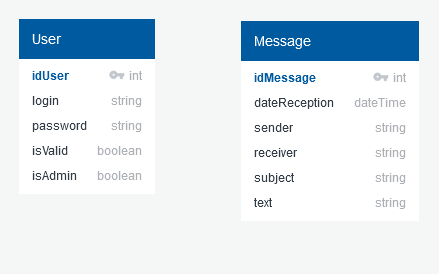

# STI-Projet1_Canton_Zaccaria

## BDD

Utilisateur
	login(text)
	password(text)
	validité(boolean)
	admin(boolean)
	
Message
	dateReception(date)
	expediteur(text)
	destinataire(text)
	sujet(text)
	corpsMessage(text)
	

### QuickDBD SYNTAXE

User

----

idUser PK int
login string
password string
isValid boolean
isAdmin boolean

Message

----

idMessage PK int
dateReception dateTime
sender string
receiver string
subject string
text string

